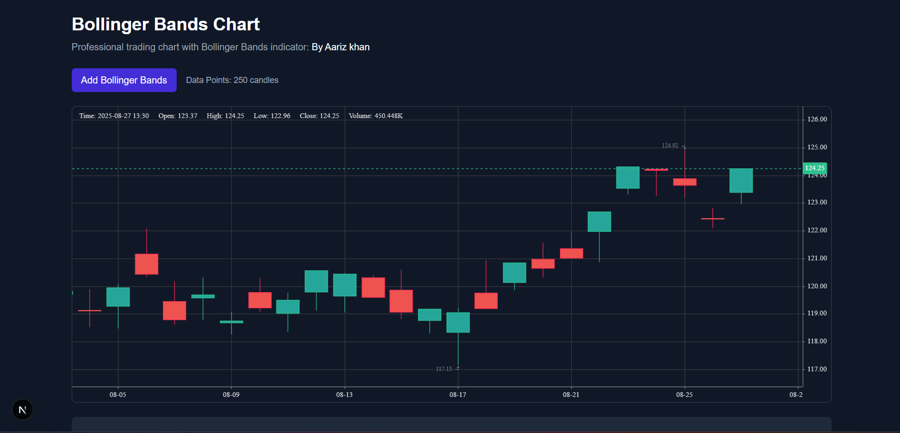

# Bollinger Bands Chart - Frontend Intern Assignment

A production-ready Bollinger Bands indicator built with React, Next.js, TypeScript, TailwindCSS, and KLineCharts.

## 🚀 Quick Start

### Prerequisites
- Node.js 18+ and npm installed
- Basic knowledge of React and TypeScript

### Installation & Setup

```bash
# 1. Clone or create the project
npx create-next-app@latest bollinger-bands-app --typescript --tailwind --eslint --app
cd bollinger-bands-app

# 2. Install required dependencies
npm install klinecharts

# 3. Install optional helper libraries
npm install lodash @types/lodash

# 4. Copy the provided code files to their respective locations:
#    - Copy types.ts to lib/types.ts
#    - Copy bollinger.ts to lib/indicators/bollinger.ts  
#    - Copy Chart.tsx to components/Chart.tsx
#    - Copy BollingerSettings.tsx to components/BollingerSettings.tsx
#    - Replace app/page.tsx with the provided main page code

# 5. Start development server
npm run dev
```

Open [http://localhost:3000](http://localhost:3000) in your browser.

## 📊 Features

### ✅ Complete Bollinger Bands Implementation
- **Configurable Inputs**: Length (20), MA Type (SMA), Source (Close), StdDev Multiplier (2), Offset (0)
- **Full Style Controls**: Visibility, colors, line width, line style for all bands
- **Background Fill**: Configurable opacity and color between upper/lower bands
- **Real-time Updates**: Instant chart updates on any setting change

### 📈 Professional Chart Experience
- **KLineCharts Integration**: Production-ready candlestick charts
- **Interactive Tooltips**: Shows Basis/Upper/Lower values on hover
- **TradingView-inspired UI**: Clean, professional settings interface
- **Dark Theme**: Optimized for trading environments

### ⚡ Performance & Quality
- **TypeScript**: Fully type-safe implementation
- **Modular Architecture**: Clean separation of concerns
- **Smooth Performance**: Handles 200-1000 candles without lag
- **Sample Data**: 250 realistic OHLCV candles included

## 🔧 Technical Details

### Bollinger Bands Formula
- **Basis (Middle Band)**: Simple Moving Average of source prices over specified length
- **Standard Deviation**: Sample standard deviation (n-1) for statistical accuracy
- **Upper Band**: Basis + (StdDev Multiplier × Standard Deviation)
- **Lower Band**: Basis - (StdDev Multiplier × Standard Deviation)
- **Offset**: Shifts all bands forward/backward by specified number of bars

### KLineCharts Version
- **Version**: Latest stable release
- **Custom Overlay**: Bollinger Bands implemented as native KLineCharts overlay
- **Performance**: Optimized for real-time updates and smooth interactions

## 📁 Project Structure

```
bollinger-bands-app/
├── app/
│   ├── page.tsx              # Main application page
│   ├── layout.tsx            # Next.js app layout
│   └── globals.css           # Global styles
├── components/
│   ├── Chart.tsx             # Chart wrapper with KLineCharts
│   └── BollingerSettings.tsx # Settings modal (Inputs + Style tabs)
├── lib/
│   ├── indicators/
│   │   └── bollinger.ts      # Core Bollinger Bands calculations
│   └── types.ts              # TypeScript type definitions
├── public/
│   └── data/
│       └── ohlcv.json        # Sample OHLCV data (optional)
└── README.md                 # This file
```

## 🎯 Usage Instructions

### Adding Bollinger Bands
1. Click **"Add Bollinger Bands"** button
2. Chart will display the indicator with default settings
3. Use **Settings** button to customize inputs and styling

### Configuring Settings

#### Inputs Tab
- **Length**: Period for moving average calculation (1-100)
- **MA Type**: Moving average type (SMA only for this version)
- **Source**: Price source (Close, Open, High, Low)
- **StdDev**: Standard deviation multiplier (0.1-10.0)
- **Offset**: Shift bands forward/backward (-50 to +50)

#### Style Tab
- **Basic Band**: Middle line visibility, color, width, style
- **Upper Band**: Upper line visibility, color, width, style  
- **Lower Band**: Lower line visibility, color, width, style
- **Background Fill**: Area fill between bands with opacity control

### Interactive Features
- **Hover Tooltips**: View exact Basis/Upper/Lower values
- **Real-time Updates**: Settings changes apply instantly
- **Crosshair**: Professional trading chart crosshair
- **Zoom & Pan**: Standard chart navigation (mouse wheel, drag)

## 🎨 Screenshots





### Main Chart View
- Clean candlestick chart with Bollinger Bands overlay
- Professional dark theme optimized for trading
- Real-time price tooltips and crosshair

### Settings Interface  
- TradingView-inspired modal with tabbed interface
- Comprehensive input controls with validation
- Live preview of style changes

## 🔍 Code Quality Features

### Type Safety
- Complete TypeScript coverage with strict mode
- Proper interfaces for all data structures
- Type-safe prop passing and state management

### Modular Design
- Separation of calculation logic from UI components
- Reusable utility functions for mathematical operations
- Clean component boundaries with well-defined props

### Performance Optimizations
- Efficient re-calculations only when needed
- Optimized rendering with proper React patterns
- Minimal re-renders on settings changes

## 🐛 Known Issues & Trade-offs

### Current Limitations
- **MA Types**: Only SMA supported (as per assignment requirements)
- **Data Source**: Uses generated sample data (easily replaceable with real data)
- **Mobile**: Optimized for desktop; mobile experience could be enhanced

### Trade-off Decisions
- **Chart Library**: KLineCharts chosen for professional features vs. simpler alternatives
- **Calculation Method**: Sample standard deviation (n-1) for statistical accuracy
- **UI Framework**: Modal-based settings vs. sidebar for cleaner interface

## 🚀 Potential Enhancements

### Technical Improvements
- Add EMA, WMA, and other moving average types
- Implement data streaming for real-time updates
- Add chart export functionality (PNG, SVG)

### UI/UX Enhancements
- Mobile-responsive design improvements
- Keyboard shortcuts for common actions
- Chart annotation tools

### Advanced Features
- Multiple timeframe support
- Additional technical indicators
- Alert system for band breakouts

## 📝 Development Notes

### Standard Deviation Choice
Using **sample standard deviation (n-1)** as it's more appropriate for financial time series analysis and provides more conservative band widths.

### Performance Considerations
- Chart updates are debounced for smooth interaction
- Only necessary calculations are performed on setting changes
- Memory-efficient data structures for large datasets

## 🤝 Support

For questions or issues related to this implementation:
1. Check the browser console for any error messages
2. Verify all dependencies are properly installed
3. Ensure chart container has sufficient height/width

---

**Assignment completed with full feature requirements and professional code quality standards.**
        
